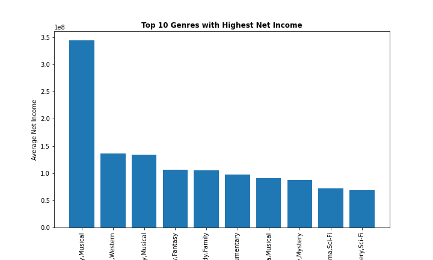
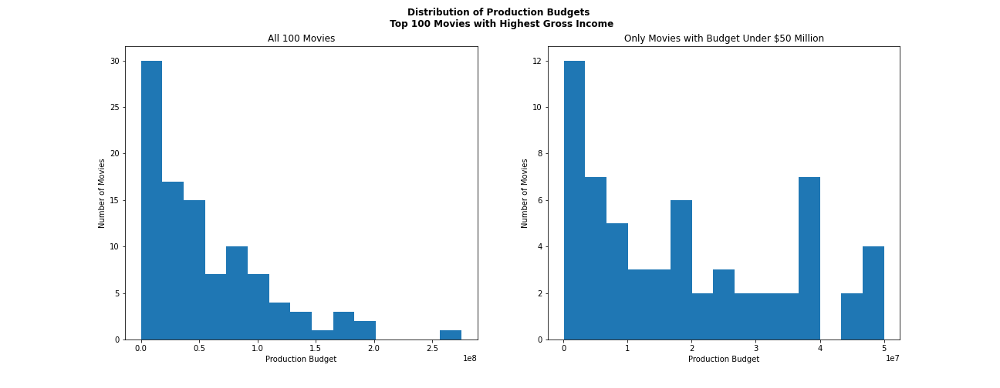
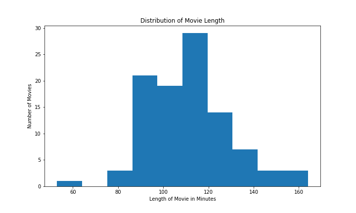

# Movie Performance Analysis Overview

**Author:** Isabella Scribner

## Overview

This project takes in movie data from four different sources in order to analyze what movies have been successful. The analysis shows that the genres of action, adventure, and family-friendly, movies with a production pudget between $10 and $50 million, and movies with a length of 90 to 120 minutes are the most successful. Microsoft can utilize this data in its consideration of the new movie studio venture.


## Business Problem

Microsoft would like some initial data one what movies have been "recently successful in the box office."  In this analysis we explore in depth specifically what genres have done well on average over the past twenty years, as well as the common production budget and length of movies that have been successful.  This analysis focuses on domestic results as the venture would most likely be focused here prior to being released internationally.  


## Data

Four sources of movie data was provided for this analysis:
* [Box Office Mojo](https://www.boxofficemojo.com/)
* [IMDB](https://www.imdb.com/)
* [Rotten Tomatoes](https://www.rottentomatoes.com/)
* [TheMovieDatabase](https://www.themoviedb.org/)
* [The Numbers](https://www.the-numbers.com/)

While the data from Rotten Tomatoes is disregarded in this analysis due to the smaller sample size, the rest of the four sources are utilized.  The data from IMDB specifically is used the most and interwoven with the other sources as needed.  The IMDB data includes more than 100,000 movie entries, or instances of data.  Some of this is lost when joined with the three other sources.

The other sources of data include important information used to measure the success, domestic gross income, production budget, (extrapolated) domestic net income, runtime minutes, rating, and vote count.  This project, focused on the average income and budgets by genre over the past twenty years.  The analysis also notes the distribution of production budgets and runtime lengths for the top 100 grossing movies from the past twenty years.


## Methods

Python, with the pandas, sqlite3, and matplotlib libraries, along with descriptive statistics are utilized to show what genres have been most successful on average over the past twenty years. As this analysis focuses on genres, the data (after being cleaned) is all grouped by this variable, and then the top ten most successful are graphed for each measure of success. 

## Results

The analysis goes over four main questions using the extracted data:

> 1. What genres of movies make the most domestic gross income?

The striking outlier was the `Family, Fantasy, Musical` genre that spiked high above the rest of the data. Furthermore, the Action and Adventure genres were present as aspects of many of the genres that made the most domestic gross income on average over the past 20 years.
    
> 2. What genres of movies are the most expensive to make?

Action and Adventure genres pop up as aspects in the genres with the highest production budgets.  The other notable genre that appears as an aspect in many of the top ten is Science Fiction.

> 3. What genres of movies make the most amount of profit?



Again, the `Family, Fantasy, Musical` genre far surpases any other genre in terms of average net income over the past 20 years. The other notable genres included Action, Adventure, Drama, and Comedy.

> 4. What genres of movies are the most popular?

The Action, Adventure, and Drama genres are all highly rated. The `Action, Adventure, Sci-Fi` genre specifically had more interaction from audiences (more votes) than any other genre from the TMDB data, however even that outlier had substantially less interaction than the top ten from the IMDB data; Drama was the most interacted with from this data set, which can be explained in part as it is the genre that has the most amount of movies total.  Lastly, we see that drama, documentary, and comedy movies are all quite popular.

> 5. What was the most common production budget from the most successful movies?



A vast majority of the top 100 grossing movies had a production budget of under $50 million.  Of these movies, taking a deeper look at the successful movies of a production budget under $50 million, we can see that a noteable amount have a budget under $10 million as well, though the range of $10-40 million is in total most common.

> 6. What was the most common runtime length from the most successful movies?



The analysiis quite clearly displayes that the most successful movies are between 90 and 120 minutes long.  


## Conclusions

1. Genre Recommendation
    * Action + Adventure
    * Family-Friendly
2. Production Budget Recommendation
    * $50 million or less
3. Movie Length Recommendation
    * 90-120 minutes

Putting the results all together, there are a few different directions Microsoft could direct their movie studio to.  The surest best seems to be to pursue movies in the action and adventure genres. While they are on the higher end of the budget spectrum, movies with these two categories incorporated in their genres have been popular and made profits over the past 20 years. 

They could also look into creating dramas, as they would cost less money to make, would still make decent profit and gain traction and interaction with audiences as they tend to be quite popular.  Although they would be competing with a wide scope of movies already in this genre.

If interested in more of a niche market, Documentaries would be the way to go as they would be generally very well received by viewers, and would not be as expensive to create, even if profits would also be less as well.  

Microsoft could pursue the family-friendly types of movies.  The positives of going in this direction is that these movies tend to be very popular, and have the potential to garner the highest net income by leaps and bounds.  However, this would also be a rather competitive market, going up against companies like Disney and Pixar that have, and continue to dominate the market.

Moving forward from the genre portion of the study, it is highly advisable that the studio keeps their production budgets at or under $50 million, or even $10 million if possible.  Keeping the production budget reined in for a highly successful movie will lead to greater net profits, however it is important to keep in mind the quality of the movie.  If the movie is not of good quality it will not be a success no matter how high the production budget.

Lastly, it is recommended to create movies that fall between 90 and 120 minutes long.  Not only do the most successful movies generally fall within this range, but this range is also industry standard.

### Next Steps

Further research and planning of course must be completed prior to the launch of this new venture. Other than just a genre study, information on what directors and writers have been successful would be imperative to see who to potentially hire. Furthermore, investigation on trends over time would be helpful, both in identifying trends genres that do well when released in a specific time of year (such as releasing a holiday themed drama in November or December rather than in March or June), and in historical trends over the years.  It would also be good to dig into more recent data as well, looking only at the past five years rather than averages over the past 20. Lastly, investigating how all of these results change when talking on an international level rather than only domestically would need to be investigated prior to expanding business in this direction as well.

## For More Information

See the full analysis of the genre results in the [Jupyter Notebook](https://github.com/Bella3s/movie-analysis-project/blob/master/movie_performance_analysis.ipynb), or review in this [presentation](https://github.com/Bella3s/movie-analysis-project/blob/master/pdfs/presentation.pdf).

## Repository Structure


```
├── images
├── pdfs
├── zippedData
├── README.md
├── movie_performance_analysis.ipynb
```